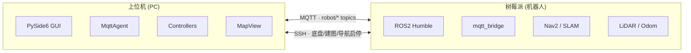
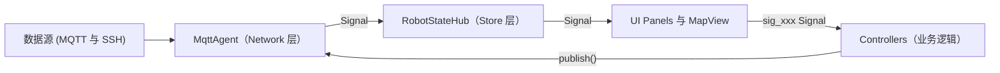

# 系统全景 — rosConPanel-mqtt

> **管辖 Agent：** 架构师 Agent
> **文档状态：** 归档快照，变更需经架构评审

---

## 部署拓扑

---

## 技术栈

| 类别 | 技术 | 版本 |
|------|------|------|
| 语言 | Python | 3.10+ |
| GUI 框架 | PySide6 (Qt6) | 6.x |
| 通信协议 | MQTT (paho-mqtt) | 2.x |
| 远程管理 | SSH (asyncssh) | — |
| 机器人框架 | ROS2 Humble | — |
| 测试 | pytest | — |

---

## 架构模式：MVVM

**数据流方向：**
1. `MqttAgent` 收到 MQTT 消息 → 解析 → 发射 Signal（如 `pose_updated`）
2. `RobotStateHub` 订阅 MqttAgent Signal → 更新内部状态 → 发射 UI Signal（如 `robot_pose_changed`）
3. UI Panels 订阅 RobotStateHub Signal → 刷新显示
4. 用户操作 → Panel 发射 `sig_xxx` Signal → Controller 响应 → 调用 `MqttAgent.publish()` 或 `AsyncSSHManager`

---

## MQTT Topic 映射表

| Topic Key | MQTT Topic | ROS2 话题 | 消息方向 | 用途 |
|-----------|-----------|-----------|---------|------|
| `pose` | `robot/pose` | `/amcl_pose` | 机器人→上位机 | AMCL 定位位姿 |
| `odom` | `robot/odom` | — | 机器人→上位机 | 里程计位姿（建图模式） |
| `status` | `robot/status` | — | 机器人→上位机 | 底盘状态 + 电压 |
| `map` | `robot/map` | — | 机器人→上位机 | 压缩地图数据（OccupancyGrid） |
| `scan` | `robot/scan` | — | 机器人→上位机 | 激光雷达扫描数据 |
| `goal` | `robot/goal` | `/goal_pose` | 上位机→机器人 | 导航目标点 |
| `initial_pose` | `robot/initial_pose` | `/initialpose` | 上位机→机器人 | 初始位姿设定 |
| `path` | `robot/path` | — | 机器人→上位机 | Nav2 全局路径规划 |

---

## 模块职责总览

### Network 层

| 模块 | 职责 |
|------|------|
| `src/network/mqtt_agent.py` | MQTT 连接管理、消息收发、ROS 消息适配 |
| `src/network/async_ssh_manager.py` | SSH 远程命令执行（底盘/建图/导航启停、地图传输） |

### Core 层

| 模块 | 职责 |
|------|------|
| `src/core/models.py` | 数据模型（RobotPose, MapMetadata）、枚举（SystemState）、应用状态机（AppSystemState）、错误聚合 |
| `src/core/constants.py` | 全局配置加载、常量定义 |

### Controller 层

| 模块 | 职责 |
|------|------|
| `src/controllers/navigation_controller.py` | 导航目标下发、初始位姿设定 |
| `src/controllers/teleop_controller.py` | 键盘遥控 |
| `src/controllers/workflow_controller.py` | 多步工作流编排（建图/导航启停流程） |
| `src/controllers/service_controller.py` | 服务状态切换（MQTT/底盘/建图/导航）、地图上传下载 |
| `src/controllers/map_manager.py` | 地图文件加载、显示、坐标转换 |
| `src/controllers/pose_recorder.py` | 位姿记录与轨迹导出 |

### Store 层

| 模块 | 职责 |
|------|------|
| `src/ui_v2/robot_state_hub.py` | 集中状态管理（MVVM 中的 ViewModel） |

### UI 层

| 模块 | 职责 |
|------|------|
| `src/ui_v2/main_window.py` | 主窗口布局、信号绑定 |
| `src/ui_v2/theme.py` | 全局主题、色盘、样式 |
| `src/ui_v2/panels/control_panel.py` | 控制面板（建图/导航/底盘按钮） |
| `src/ui_v2/panels/telemetry_panel.py` | 遥测数据面板（电压/位姿/状态） |
| `src/ui_v2/panels/teleop_panel.py` | 键盘遥控面板 |
| `src/ui_v2/panels/pose_panel.py` | 位姿记录面板 |
| `src/ui_v2/panels/unified_drawer.py` | 可折叠抽屉容器 |
| `src/ui_v2/map/map_view.py` | 地图视图（QGraphicsView） |
| `src/ui_v2/map/layers.py` | 地图图层（栅格/占据图/路径/激光/机器人/箭头） |

---

*本文档从代码库归档生成。如需修改架构，须先更新此文档再动代码。*
