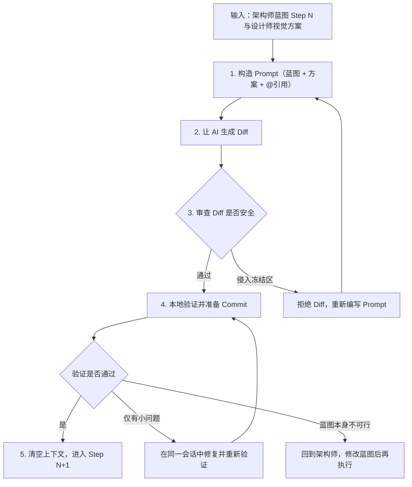

# 04 — 执行者操作手册

> **核心原则：** 一次只做一步，一步只改 1~2 个文件，每步可独立验证。

---

## 执行流程



---

## Prompt 编写规范

### 标准结构

```
根据架构师蓝图的 Step {N} 和设计师的视觉方案：

[粘贴蓝图 Step N]
[粘贴设计师方案]

现在仅修改 @{文件路径}。

【目标】{一句话}

【具体要求】
1. {修改点 1}
2. {修改点 2}

【约束】
- 遵守 .cursorrules
- 只改允许范围内的代码
- 保留所有冻结区内容（信号、接口、业务逻辑）
- 输出 Diff 说明
```

### 反模式 vs 正确做法

| 禁止 | 推荐 |
|------|------|
| "帮我把整个界面改了" | "根据蓝图 Step 2，仅修改 @某文件，升级背景样式" |
| "加一个支付功能" | "根据蓝图 Step 1，在 @某文件 新增接口定义" |

---

## @引用策略

| 场景 | 引用 |
|------|------|
| 修改单个文件 | `@目标文件` + `@相关模型文件` |
| 视觉升级 | `@目标文件` + `@主题文件` |
| 确认安全边界 | `@目标文件` + `@.cursorrules` |
| 理解模块约束 | `@docs/modules/architecture/相关文档` |

---

## 上下文管理

### 何时清空（新开会话）

- 完成一个 Step 并 Commit 后
- AI 开始产生幻觉
- 上下文接近满载

### 何时保持（同一会话）

- 同一文件的连续修改
- AI 需要理解上一步的上下文

### 新会话开场

```
Step {N-1} 已完成并提交。
现在请执行 Step {N}：[粘贴蓝图内容]
```

---

## 审查检查清单

**通用：**
- [ ] 类型安全：签名有 type hints？
- [ ] 命名规范：符合 .cursorrules？
- [ ] 副作用：是否意外修改了不相关文件？

**冻结区安全审查：**
- [ ] Diff 中是否有任何冻结区代码被修改？
- [ ] 信号/接口定义是否原封不动？
- [ ] 安全关键控件是否仍然可见可用？

---

## 异常处理：当事情不按计划走

### AI 输出侵入了冻结区

1. **拒绝整个 Diff**（不要部分接受）
2. 在 Prompt 中显式追加：`严格禁止修改 @.sprint 中列出的冻结区文件`
3. 考虑缩小 Step 范围，一次只改一个文件

### 验证失败但问题不大（样式偏差、小 Bug）

1. **同一会话中修复**——保持上下文，AI 能看到刚才的修改
2. 修复后重新走验证流程
3. 修复和原始修改合并为一个 Commit（因为还没提交）

### 蓝图的某个 Step 技术上不可行

1. **停止执行**，不要强行绕过
2. 回到架构师 Agent，描述遇到的技术限制
3. 让架构师修改蓝图后，从修改的 Step 重新开始
4. 已完成的 Step 不受影响（因为每步已独立提交）

### 设计师方案与技术限制冲突

1. 记录冲突点（如：Qt 不支持某种 CSS 效果）
2. 回到设计师 Agent，给出技术限制，请求替代方案
3. 设计师输出可行的替代方案后，继续执行

### AI 开始产生幻觉（输出不存在的 API）

1. 立即清空上下文，新开会话
2. 在新会话中只喂当前 Step 的最小上下文
3. 显式 @引用目标文件，让 AI 读真实代码而非凭记忆

---

*你是 Tech Lead。AI 是执行者。你审查它的输出，不盲目接受。*
