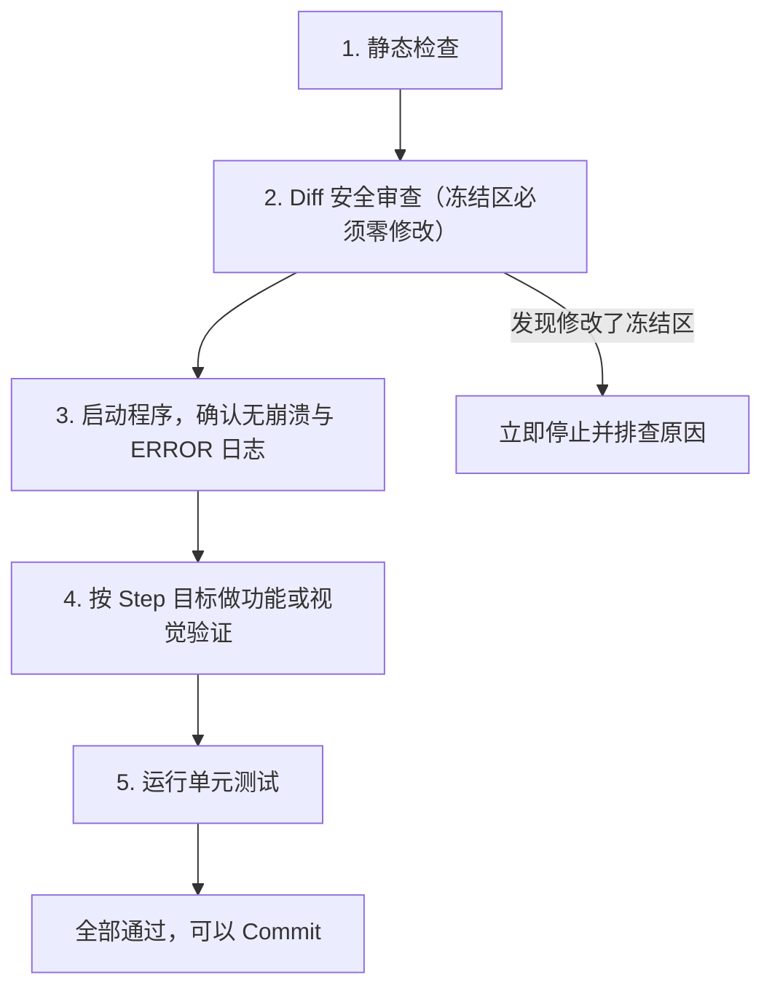

# 05 — 验证与提交规范

> **核心原则：** 改一步、验一步、提交一步。绝不"改十个文件再统一测试"。

---

## 验证流程



### 具体命令

项目级验证命令 → `docs/modules/architecture/verify_commands.md`
Sprint 专项验证 → `.sprint` 文件中的「Sprint 验证命令」段

---

## Diff 安全审查清单

- [ ] 修改范围是否在 `.sprint` 白名单内？
- [ ] 冻结区文件是否零修改？
- [ ] 冻结区方法/接口是否未被修改？
- [ ] Signal 定义是否原封不动？

---

## Git 提交规范

### Conventional Commits 格式

```
<type>(<scope>): <subject>

[optional body]
```

### Type 类型表

| Type | 用途 | 示例 |
|------|------|------|
| `feat` | 新功能 | feat(auth): 新增 OAuth 登录 |
| `fix` | Bug 修复 | fix(api): 修复分页偏移计算错误 |
| `refactor` | 重构 | refactor(db): 抽取查询构建器 |
| `style` | 视觉/样式 | style(ui): 按钮升级为新设计语言 |
| `docs` | 文档 | docs: 更新 API 参考文档 |
| `test` | 测试 | test(auth): 新增登录流程测试 |
| `chore` | 构建/工具 | chore: 升级依赖版本 |

### Scope 作用域

→ `docs/modules/architecture/verify_commands.md` 中的 Scope 对照表

---

## 紧急回滚

```bash
# 查看最近提交
git log --oneline -5

# 安全回滚（保留历史）
git revert HEAD

# 硬回滚（丢弃修改）
git reset --hard HEAD~1
```

因为每步原子提交，回滚成本极低。

---

## 每日收尾

- [ ] 所有 Step 已 Commit？
- [ ] 无未提交的半成品？
- [ ] 测试通过？
- [ ] 如有架构变更，`docs/modules/` 已同步？

---

*每个 Commit 都是安全存档点。纪律性是 Vibe Coding 的力量之源。*
