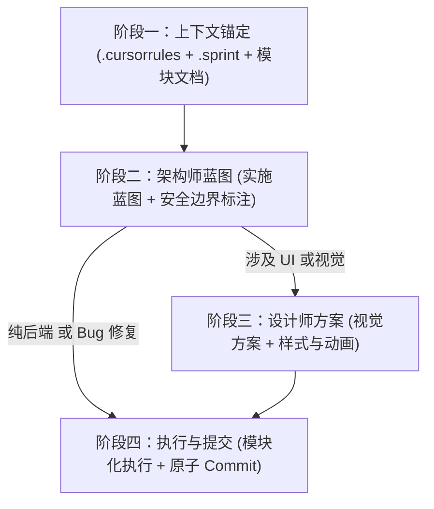
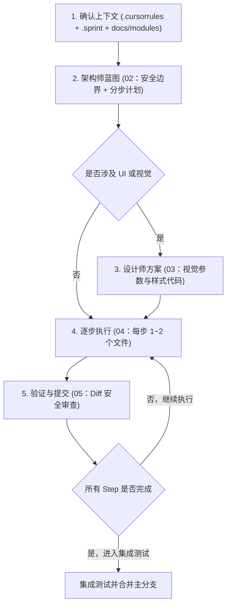

# Vibe Coding 标准工作流 (SOP)

> **核心理念：Plan First, Code Second.**
> 永远不要让 AI 一上来就生成代码，必须先输出架构设计与修改清单。

---

## 双 Agent 系统

| Agent | 角色 | 何时激活 |
|-------|------|---------|
| 架构师 Agent | 工程严谨、安全、可扩展性 | 所有任务（新功能/重构/修复/UI 升级） |
| 设计师 Agent | 极致品味、用户体验 | **仅**涉及 UI/视觉变更时 |

> 纯后端任务、纯 Bug 修复不需要设计师 Agent，直接从阶段二跳到阶段四。

---

## 工作流（按任务类型选择路径）

---

## 文档索引

| 文件 | 用途 | 何时使用 |
|------|------|----------|
| [01_project_context_template.md](01_project_context_template.md) | 项目上下文填写模板 | 新项目初始化时填写 |
| [02_architect_prompt_template.md](02_architect_prompt_template.md) | 架构师 Agent Prompt 模板 | 向架构师提需求时复制使用 |
| [03_designer_prompt_template.md](03_designer_prompt_template.md) | 设计师 Agent Prompt 模板 | 架构师蓝图完成后，**仅 UI 任务** |
| [04_executor_guide.md](04_executor_guide.md) | 执行者操作手册 | 在 IDE 中逐步实施时参考 |
| [05_verify_and_commit.md](05_verify_and_commit.md) | 验证与提交规范 | 每完成一步后执行 |

---

## 快速上手

---

## 配套体系

| 位置 | 作用 | 稳定性 |
|------|------|--------|
| `.cursorrules` | 长期 AI 规则（架构/编码/禁止事项） | 跨 Sprint 稳定 |
| `.sprint` | 当前 Sprint 约束（修改范围/冻结区/专项 DoD） | 随 Sprint 更新 |
| `docs/modules/architecture/` | 架构 Agent 管辖（冻结后端、信号契约） | 架构变更时更新 |
| `docs/modules/taste/` | 设计 Agent 管辖（品味原则、设计系统、Apple 设计规范） | 设计语言变更时更新 |

> `workflow/` = **怎么做**（通用方法论）
> `docs/modules/` = **做什么**（项目知识）
> `.sprint` = **这轮做什么**（时效约束）
